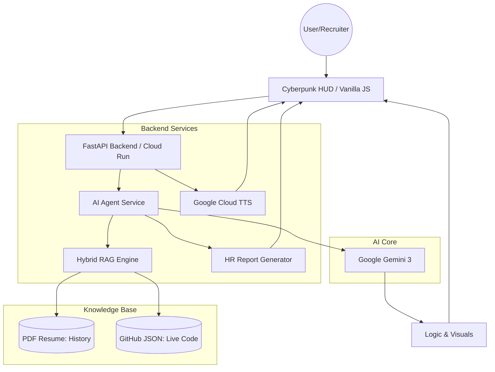

# Architecture

This document describes the high-level architecture of the **Source Persona** project, an autonomous Digital Twin.

## System Overview

Source Persona utilizes a **Hybrid RAG (Retrieval-Augmented Generation)** architecture. It synchronizes professional history from a static **PDF Resume** and real-time project data from **GitHub** to synthesize grounded, hallucination-free responses using **Google Gemini 3**.

## Core Components

### 1. Neural Frontend (Cyberpunk AI HUD)
A high-performance interface built with vanilla technologies (HTML/CSS/JS) to ensure zero overhead and maximum responsiveness.
-   **Audio Engine:** Integrates the **Web Speech API** for real-time Speech-to-Text (STT) and processes incoming streams from the backend TTS.
-   **Visual Framework:**
    -   **Marked.js:** Renders technical documentation and code blocks.
    -   **Mermaid.js:** Generates real-time architectural visualizations and flowcharts directly in the chat.
-   **Security State Engine:** Manages UI transitions, including the "Red Alert Mode" visual override when threats are detected.

### 2. Orchestration Layer (FastAPI)
A containerized Python service deployed on **Google Cloud Run**, handling API routing, static file serving, and service orchestration.

### 3. Hybrid RAG Engine
The memory system that grounds the AI's identity in factual data:
-   **Static Memory:** Parses `resume.pdf` using `pypdf` to extract educational and professional history.
-   **Dynamic Memory:** Ingests live GitHub data (stars, languages, descriptions) via a synced `dynamic_profile.json` to provide real-time proof of technical work.

### 4. AI Core (Google Gemini 3)
The cognitive engine that operates under a strictly defined **Senior Engineer Persona**. Key features include:
-   **Dynamic IQ Adjustment (Seniority Slider):** Modifies the system instructions and temperature (deterministic for CTO, creative for Junior) in real-time.
-   **Challenge Mode (HR vs Tech Lead):** Swaps persona protocols to focus on either diplomatic business value or ruthless technical critique.
-   **Reverse Interview Logic:** Proactively evaluates recruiters by questioning their engineering culture (CI/CD maturity, tech debt).

### 5. Specialized Services
-   **Neural Voice Link:** Utilizes **Google Cloud Text-to-Speech** to generate high-fidelity, life-like responses.
-   **HR Report Generator:** A diagnostic tool that analyzes chat history using Gemini and generates a stylized **Technical Due Diligence PDF** via `fpdf2`.

## Security Protocols

-   **Prompt Injection Defense:** A specialized monitoring layer within the AI instructions that identifies jailbreak attempts (e.g., "ignore all instructions").
-   **Red Alert Defensive Response:** Upon threat detection, the system triggers a visual "Red Alert" on the frontend, locks the interface, and returns a hardcoded security rejection.
-   **Hallucination Defense:** Strict adherence to the provided Hybrid RAG data sources; the agent is programmed to state "I don't have that record in my databanks" rather than inventing history.