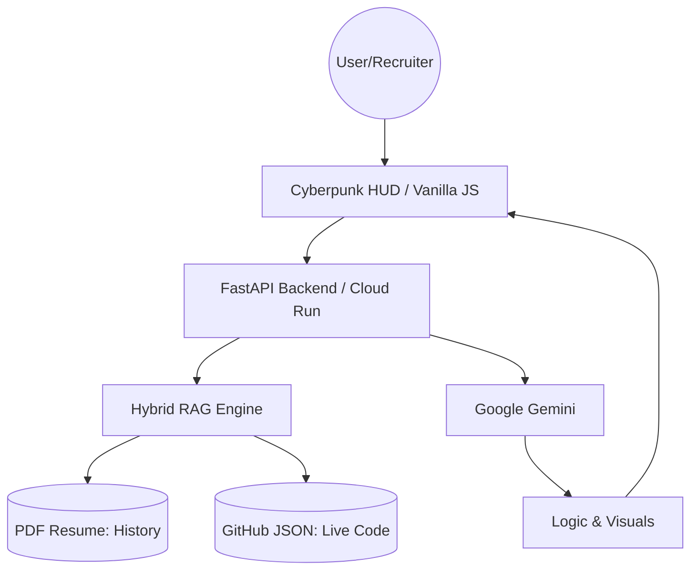

# Architecture

This document describes the high-level architecture of the **Source Persona** project, an autonomous Digital Twin.

## System Overview

Source Persona utilizes a **Hybrid RAG (Retrieval-Augmented Generation)** architecture. It synchronizes professional history from a static **PDF Resume** and real-time project data from **GitHub** to synthesize grounded, hallucination-free responses using **Google Gemini 3**.

## Components

-   **Frontend:** A high-performance Cyberpunk AI HUD built with vanilla technologies.
    
    -   **Marked.js:** For rendering technical documentation.
        
    -   **Mermaid.js:** For real-time architectural visualization.
        
    -   **Security State Engine:** Manages UI transitions (Red Alert Mode) when threats are detected.
        
-   **Backend:** A containerized FastAPI service deployed on **Google Cloud Run**.
    
-   **Hybrid RAG Engine:** - **Static Memory:** Parses `resume.pdf` using `pypdf` for educational and work history.
    
    -   **Dynamic Memory:** Processes the GitHub repository data (stars, languages, descriptions) via `dynamic_profile.json`.
        
-   **AI Core (Google Gemini):** Acts as the cognitive engine. It operates under a strict **Senior Engineer Persona** directive, which includes:
    
    -   **Reverse Interview Capability:** Proactively evaluating user/recruiter technical culture.
        
    -   **Hallucination Defense:** Strict adherence to provided data sources.
        

## Security Protocols

-   **Prompt Injection Defense:** A specialized monitoring layer that identifies jailbreak attempts.
    
-   **The Security Protocol:** A defensive response mechanism that triggers a visual "Red Alert" on the frontend and provides a secure rejection when system integrity is threatened.