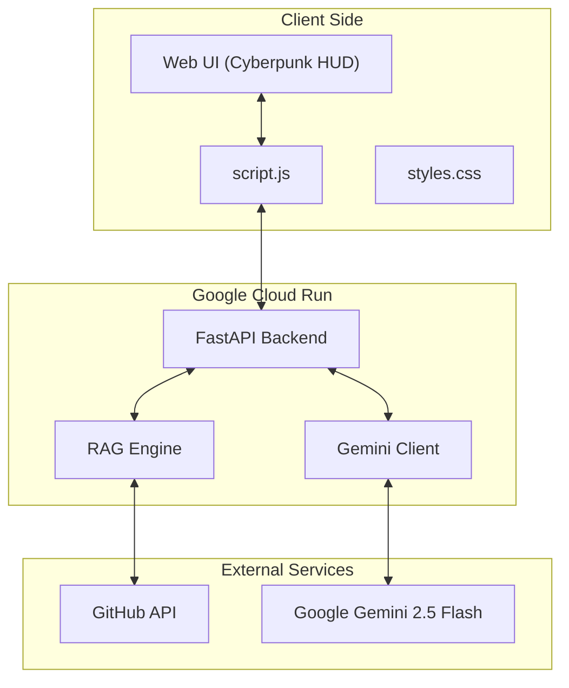

# Architecture

This document describes the high-level architecture of the **Source Persona** project.

## System Overview

Source Persona is an autonomous Digital Twin deployed on Google Cloud Run. It utilizes a RAG (Retrieval-Augmented Generation) architecture to fetch user data from GitHub and synthesize personalized responses using Google Gemini 2.5.

## Components

- **Frontend:** A futuristic Cyberpunk/Glassmorphism AI HUD built with vanilla JS/CSS.
    
- **Backend:** FastAPI service hosted on Google Cloud Run.
    
- **RAG Engine:** Parses the repository code and READMEs to build the context memory.
    
- **AI Core:** Google Gemini 2.5 Flash serves as the cognitive engine for generating persona-based answers.
