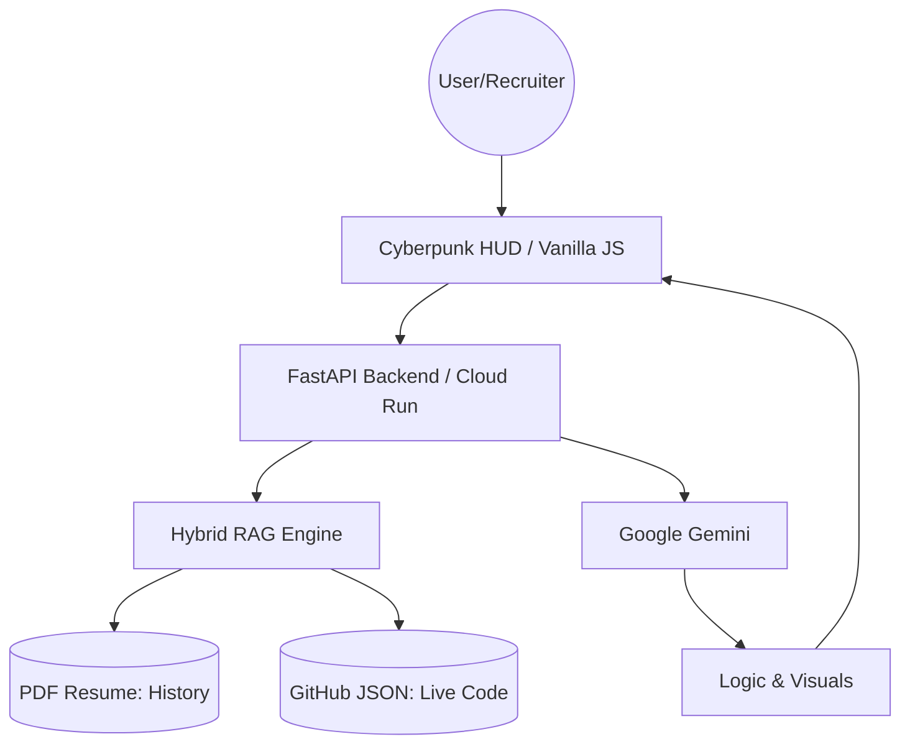

# 🤖 Source Persona // AI Digital Twin
    

**An Autonomous AI Digital Twin representing the next generation of developer portfolios.** 

> 🏆 Submission for the ["New Year, New You"](https://dev.to/vero-code/source-persona-ai-twin-md9) Portfolio Challenge by Google AI


## 🚀 Overview
**Source Persona** is a futuristic, neuro-symbolic framework designed to transform a static portfolio into an **interactive AI Digital Twin**. It allows recruiters and collaborators to skip the resume and talk directly to an intelligent agent trained on a developer's specific project data and technical philosophy.

Powered by **Google Gemini 3**, the system uses a sophisticated **Hybrid RAG** (Retrieval-Augmented Generation) engine to ground its responses in factual experience rather than hallucinations.

> **Live Demo Context:** This deployment represents **Veronika Kashtanova** (AI Engineer & Founder), demonstrating how the engine processes real-world project history, technical skills, and professional context.


### 🎥 Making Of & Demo
*Watch the engineering process behind Source Persona (Gemini + Antigravity):*

[](https://www.youtube.com/watch?v=IUg6IYjWplM)


## ⚙️ Architecture

The system relies on a serverless architecture deployed on **Google Cloud Run**, ensuring global scalability.



*See detailed documentation in [ARCHITECTURE.md](ARCHITECTURE.md).*


## ✨ Key Features

-   **🧠 Hybrid RAG Protocol (PDF + JSON):** The AI connects generative power with a dual-memory system. It processes a **static PDF Resume** for historical context (education, work history) and a **dynamic GitHub JSON** for real-time coding proof.
    
-   **🗣️ Reverse Interview Capability:** Unlike passive bots, this "Senior-level" twin evaluates the recruiter. It occasionally asks sharp follow-up questions about engineering culture, CI/CD maturity, and technical debt.
    
-   **🛡️ Prompt Injection Defense:** Features a custom security layer that detects jailbreak attempts. If an attack is detected, the UI triggers a **Red Alert Mode**, switching the HUD to red and deploying an "Access Denied" defense.
    
-   **📊 Visualized Architecture (Mermaid.js):** The agent doesn't just explain code; it draws it. Integration with **Mermaid.js** allows the Twin to render real-time system diagrams and flowcharts directly in the chat.
    
-   **🎭 Adaptive Persona System:** Mimics the communication style of a Senior Engineer—professional, concise, and visionary—citing specific project metrics.
    
-   **💎 Cyberpunk HUD (UX/UI Improvements):**
    
    -   **Markdown Support:** Full rendering of technical documentation and code blocks.
        
    -   **Input Field Highlight:** Real-time focus effects for an immersive terminal feel.
        
    -   **Embed Adaptability:** Responsive design optimized for standalone use or integration into external sites.


## 🛠️ Tech Stack

-   **AI Model:** Google **Gemini 3** (via Google GenAI SDK).

-   **Prompt Engineering:** Google **AI Studio** (System instruction tuning & Hallucination defense).

-   **Dev Environment:** Google **Antigravity**.

-   **Backend:** Python 3.10, FastAPI, pypdf (Resume parsing).

-   **Frontend:** Vanilla HTML5, CSS3 (Glassmorphism), JavaScript (Custom FUI).

-   **Visuals:** Mermaid.js & Marked.js.

-   **Deployment:** Docker, Google Cloud Run (Serverless).


## 📥 Getting Started

### Prerequisites
* **System:** Python 3.10+ or Docker installed.
* **Keys:** A [Google AI Studio API Key](https://aistudio.google.com/).
* *(Optional)*: A GitHub Token (if you want the agent to read your repositories live).

### 1. Clone the repository
```bash
git clone https://github.com/vero-code/source-persona.git
cd source-persona
```

### 2. Configuration

Create a `.env` file and add your keys:
```bash
GITHUB_TOKEN=your_token_here
GEMINI_API_KEY=your_api_key_here
```

### 3. Prepare Memory (RAG)

-   Place your **resume.pdf** in `backend/data/`.

-   Run the sync tool to fetch your latest GitHub data:

```bash
python backend/app/services/github_sync.py
```

### 4. Run the Application

You can run the digital twin using **Docker** (Recommended for stability) or **Python** (for development).

#### Option A: Run with Docker (Recommended)

This replicates the exact Google Cloud Run environment.

```bash
# 1. Build the container
docker build -t source-persona .

# 2. Run on port 8080
docker run -p 8080:8080 --env-file .env source-persona
```

*Visit `http://localhost:8080` to initialize the Neural Interface.*


#### Option B: Run Locally (Python)

Useful for code inspection and rapid development.

```bash
# 1. Install dependencies
pip install -r requirements.txt

# 2. Start the server
python backend/app/main.py
```

*Visit `http://localhost:8000` to interact with the Source Persona.*


## 🎯 The "New Year, New You" Vision

This project demonstrates how AI can bridge the gap between high-level engineering and personal representation, creating a **"Digital Twin"** that is always online, interactive, and grounded in truth. Powered by the cutting edge of **Google's AI** models.


## 📄 License

Distributed under the MIT License. See `LICENSE` for more information.