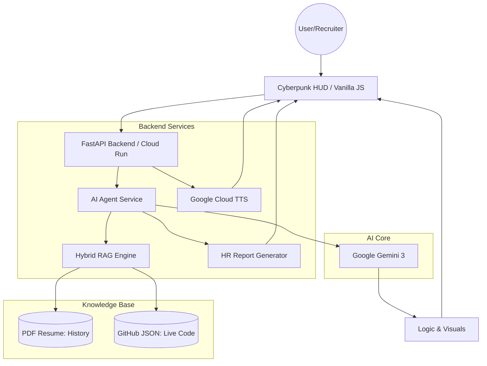

# 🤖 Source Persona // AI Digital Twin
      

**An Autonomous AI Digital Twin representing the next generation of developer portfolios.** 

> 🏆 Submission for the ["New Year, New You"](https://dev.to/vero-code/source-persona-ai-twin-md9) Portfolio Challenge by Google AI


## 🚀 Overview
**Source Persona** is a futuristic, neuro-symbolic framework designed to transform a static portfolio into an **interactive AI Digital Twin**. It allows recruiters and collaborators to skip the resume and talk directly to an intelligent agent trained on a developer's specific project data and technical philosophy.

Powered by **Google Gemini 3**, the system uses a sophisticated **Hybrid RAG** (Retrieval-Augmented Generation) engine to ground its responses in factual experience rather than hallucinations.

> **Live Demo Context:** This deployment represents **Veronika Kashtanova** (AI Engineer & Founder), demonstrating how the engine processes real-world project history, technical skills, and professional context.


_Visualizing 10 years of transition from Full-Stack Web to Generative AI Research._


### 🎥 Making Of & Demo

**✨ UPDATE v1.3:**
*See the agent **understand and speak** in real-time, the migration to **Gemini 3**, plus the new "Tech Lead Mode", Security Defense Protocol, and full deployment in action:*

[](https://www.youtube.com/watch?v=62Wex2IcoXE)

<br>

**Original Submission Demo:**
*Watch the engineering process behind Source Persona (Gemini + Antigravity):*

[](https://www.youtube.com/watch?v=IUg6IYjWplM)


## ⚙️ Architecture

The system relies on a serverless architecture deployed on **Google Cloud Run**, ensuring global scalability.



*See detailed documentation in [ARCHITECTURE.md](ARCHITECTURE.md).*


## ✨ Key Features

🧠 **Core Intelligence & Persona**

- **🎚️ Dynamic Seniority Slider:** Adjust the AI's "IQ" and experience level in real-time. Slide from **Junior** (enthusiastic learner) to **CTO** (strategic, ROI-focused) to see how the answers change complexity.

- **🎭 Challenge Mode (HR vs Tech Lead):** A dual-protocol toggle.
	- _HR Mode:_ Polite, diplomatic, focuses on soft skills and team fit.
	- _Tech Lead Mode:_ Ruthless, technical, critical of "spaghetti code," and focused on architecture and latency.

- **🧠 Hybrid RAG Protocol (PDF + JSON):** The AI connects generative power with a dual-memory system. It processes a **static PDF Resume** for historical context (education, work history) and a **dynamic GitHub JSON** for real-time coding proof.

- **🗣️ Reverse Interview Capability:** Unlike passive bots, this "Senior-level" twin evaluates the recruiter. It occasionally asks sharp follow-up questions about engineering culture, CI/CD maturity, and technical debt.

🎙️ **Neural Voice Link**

- **🎤 Bidirectional Voice Interface:** Don't just type—speak. The system integrates **Web Speech API** for real-time speech recognition (STT).

- **🔊 Google Cloud Neural TTS:** The agent replies with a high-fidelity, life-like voice generated by Google Cloud Text-to-Speech.

- **⏹️ Interactive Controls:** Features a "Listen" toggle for every AI message and a microphone input with visual feedback.

🖥️ **Cyberpunk HUD & Interface**

- **📟 Live "Matrix" Terminal:** A real-time debug console (Right Sidebar) that visualizes the backend logic: RAG retrieval status, token usage, security checks, and latency metrics.

- **💭 Visualized "Chain of Thought":** A holographic status line that reveals the AI's internal process (_Establishing Uplink -> Querying Vector DB -> Analyzing Context_) before generating a response.

- **📱 Adaptive UI:** Fully responsive design with collapsible sidebars (Menu/Terminal) for seamless use on smartphones or integration into external sites.

- **⚡ Suggestion Chips:** Quick-start interaction buttons for immediate engagement (_"Who are you?", "Tech Stack?", "Experience?"_).

- **✏️ Markdown Support:** Full rendering of technical documentation and code blocks.

- **⌨️ Input Field Highlight:** Real-time focus effects for an immersive terminal feel.

🛡️ **Security & Utilities**

- **📄 Automated HR Report Generator:** Generates a downloadable **PDF Technical Assessment** on the fly. The AI analyzes the chat history, grades the candidate's skills based on the conversation, and provides a "Hire/No Hire" verdict.

- **🛡️ Prompt Injection Defense:** Features a custom security layer that detects jailbreak attempts. If an attack is detected, the UI triggers a **Red Alert Mode**, switching the HUD to red and deploying an "Access Denied" defense.

- **📊 Visualized Architecture (Mermaid.js):** The agent doesn't just explain code; it draws it. Integration with **Mermaid.js** allows the Twin to render real-time system diagrams and flowcharts directly in the chat.


_The "Red Alert" Hallucination Defense mechanism kicking in against prompt injection._


## 🛠️ Tech Stack

-   **AI Model:** Google **Gemini 3** (via Google GenAI SDK).

-   **Voice:** Google **Cloud Text-to-Speech** API.

-   **Prompt Engineering:** Google **AI Studio** (System instruction tuning & Hallucination defense).

-   **Dev Environment:** Google **Antigravity**.

-   **Backend:** Python 3.10, FastAPI, pypdf (Resume parsing), fpdf2 (Report Gen).

-   **Frontend:** Vanilla HTML5, CSS3 (Glassmorphism), JavaScript (Custom FUI).

-   **Visuals:** Mermaid.js & Marked.js.

-   **Deployment:** Docker, Google Cloud Run (Serverless).


_The Multi-Agent Orchestration & RAG Pipeline visualizer showing the "Builder Workflow"._


## 📥 Getting Started

### Prerequisites
* **System:** Python 3.10+ or Docker installed.
* **Keys:** A [Google AI Studio API Key](https://aistudio.google.com/).
* *(Optional)*: A GitHub Token (if you want the agent to read your repositories live).

### 1. Clone the repository
```bash
git clone https://github.com/vero-code/source-persona.git
cd source-persona
```

### 2. Configuration

Create a `.env` file and add your keys:
```bash
GITHUB_TOKEN=your_token_here
GEMINI_API_KEY=your_api_key_here
```

### 3. Prepare Memory (RAG)

-   Place your **resume.pdf** in `backend/data/`.

-   Run the sync tool to fetch your latest GitHub data:

```bash
python backend/app/services/github_sync.py
```

*Note: The sync tool will create a `data` folder in the root directory.*

### 4. Run the Application

You can run the digital twin using **Docker** (Recommended for stability) or **Python** (for development).

#### Option A: Run with Docker (Recommended)

This replicates the exact Google Cloud Run environment.

```bash
# 1. Build the container
docker build -t source-persona .

# 2. Run on port 8080
docker run -p 8080:8080 --env-file .env source-persona
```

*Visit `http://localhost:8080` to initialize the Neural Interface.*


#### Option B: Run Locally (Python)

Useful for code inspection and rapid development.

```bash
# 1. Install dependencies
pip install -r requirements.txt

# 2. Start the server
python backend/app/main.py
```

*Visit `http://localhost:8000` to interact with the Source Persona.*


## 📜 Changelog (v1.3.0)

-   **Feat:** Added Voice Interaction (Microphone input + Google Cloud TTS output).

-   **UI:** Updated Header hierarchy and Logo styling.

-   **UI:** Implemented horizontal scrolling for suggestion chips on mobile.

-   **UI:** Added Mobile Terminal toggle for better responsiveness.

-   **Fix:** Resolved Web Speech API interim results bug (preventing partial phrase submission).

-   **Fix:** Strict Identity Protocol (Agent no longer identifies as generic Gemini).

-   **Feat:** Added "Send" button and toggleable "Listen" buttons for messages.

-   **Chore:** Updated Footer with GitHub link and version badge.


## 🎯 The "New Year, New You" Vision

This project demonstrates how AI can bridge the gap between high-level engineering and personal representation, creating a **"Digital Twin"** that is always online, interactive, and grounded in truth. Powered by the cutting edge of **Google's AI** models.


_Interactive visualization of the "Creative Stack" and Open Source contributions._


## 📄 License

Distributed under the MIT License. See `LICENSE` for more information.